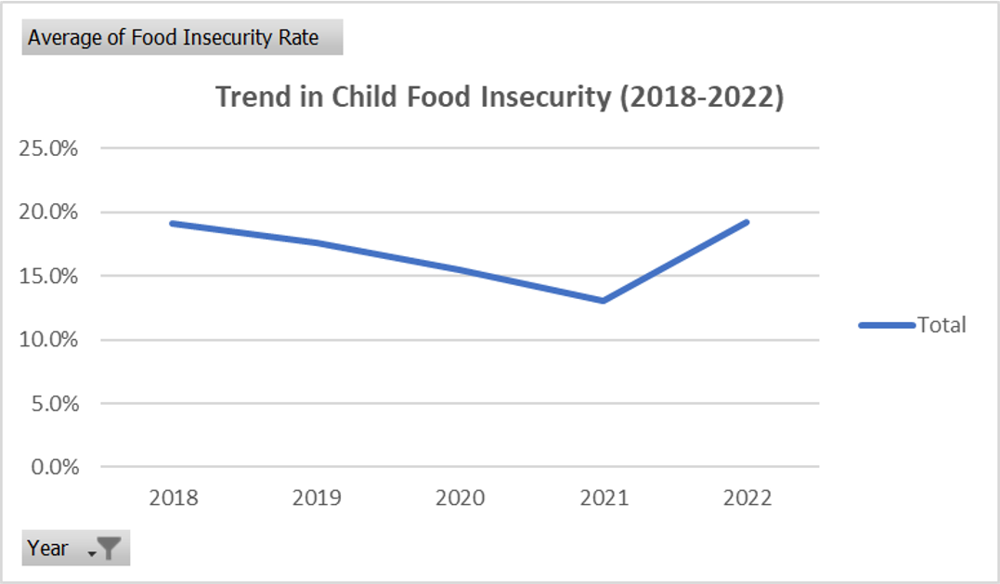
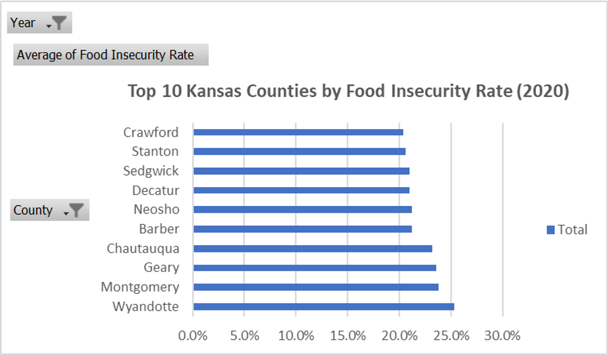

# Kansas Child Food Insecurity Analysis (2018–2022)

This project analyzes child food insecurity rates across Kansas counties using public data from the Annie E. Casey Foundation’s KIDS COUNT Data Center. The goal is to identify trends over time, highlight high-risk counties, and summarize findings with clean visuals using Microsoft Excel.

---

## 📌 Key Findings

- **Wyandotte County** had the highest food insecurity rate in 2020 at **25.3%**, followed by Montgomery (23.8%) and Geary (23.6%).
- The **average rate across the top 10 counties** in 2020 was **22.1%**, significantly above the state average.
- **Rates peaked in 2020**, reflecting the impact of the COVID-19 pandemic, but began to decline in 2021–2022.
- **Both rural and urban counties** are affected, with rural areas showing more volatility year over year.

---

## 📁 File Contents

| File / Sheet                | Description |
|----------------------------|-------------|
| `kansas_food_insecurity_analysis.xlsx` | Full Excel workbook with all analysis |
| **Sheet: `Analysis`**      | Summary page with key insights and charts |
| **Sheet: `Yearly Averages`** | Pivot table for statewide trend (used in line chart) |
| **Sheet: `Top Counties for a Given Year`** | Pivot for county-level breakdown (used in bar chart) |
| **Sheet: `Kidscount Export`** | Cleaned raw data downloaded from source |

---

## 📊 Tools Used
- Microsoft Excel (PivotTables, Charts, Formatting)
- Public data from [KIDS COUNT Data Center](https://datacenter.aecf.org/data/tables/10238-food-insecurity)

---

## 📈 Visuals

### 📉 Trend in Child Food Insecurity (2018–2022)

> **Figure 1:** Statewide child food insecurity peaked in 2020 at 16.8%, then declined in 2021–2022.

---

### 🏆 Top 10 Kansas Counties by Food Insecurity (2020)

> **Figure 2:** Wyandotte, Montgomery, and Geary counties led in food insecurity in 2020, with rates exceeding 23%.

---

## 📥 Data Source

Data downloaded from:  
🔗 [https://datacenter.aecf.org/data/tables/10238-food-insecurity](https://datacenter.aecf.org/data/tables/10238-food-insecurity)

---

## Workbook Overview

The `kansas_food_insecurity_cleaned.xlsx` Excel workbook contains a comprehensive analysis of child food insecurity rates across Kansas counties from 2018 to 2022. It includes:

- Cleaned and structured raw data imported from the KIDS COUNT Data Center.
- PivotTables summarizing yearly average food insecurity rates statewide and detailed county-level statistics.
- Visualizations such as line and bar charts highlighting trends over time and identifying the top 10 counties most affected in 2020.
- An Analysis sheet providing key insights and findings, aimed at informing data-driven decisions around food security and community support programs.

## ✍️ Author

**Brenda Garza**  
Aspiring Data Analyst | Business Administration Graduate  
📍 Based in Fort Riley, KS
